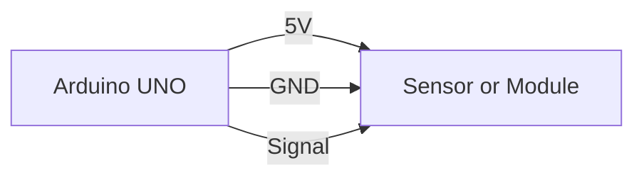
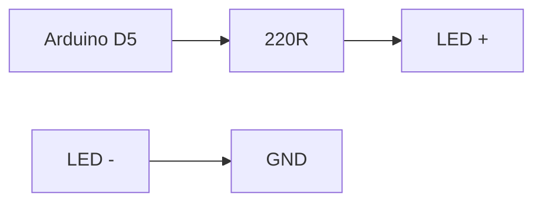
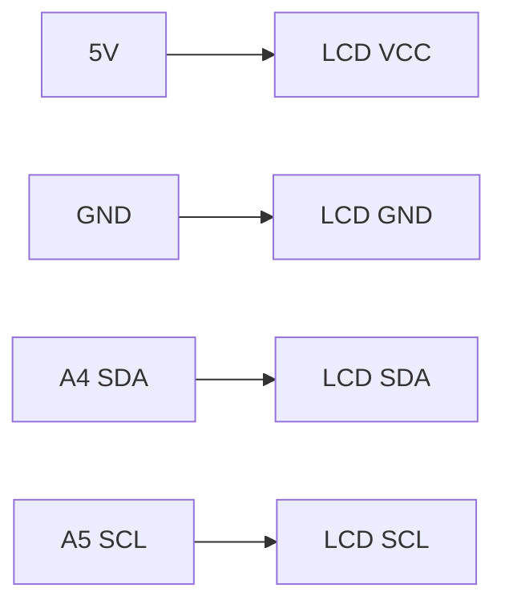

# Wiring Guide for Beginners

Use this file while wiring.
Follow one rule first: all modules must share GND with Arduino.

## 1) Common GND
If GND is not shared, signals will not work correctly.

## 2) LED Wiring
- Arduino pin -> 220R resistor -> LED anode (+)
- LED cathode (-) -> GND

## 3) I2C LCD Wiring (UNO)
- VCC -> 5V
- GND -> GND
- SDA -> A4
- SCL -> A5

## 4) HC-SR04 Wiring
- VCC -> 5V
- GND -> GND
- TRIG -> D9
- ECHO -> D10

## 5) LM35 Wiring
(Flat face of LM35 looks at you)
- Left pin -> 5V
- Middle pin -> A0
- Right pin -> GND

## 6) Servo Wiring
- Signal -> D9 (or sketch pin)
- VCC -> 5V
- GND -> GND

For stronger servos, use external 5V and connect its GND to Arduino GND.

## 7) Water Sensor Wiring
- VCC -> 5V
- GND -> GND
- AOUT -> A0

## 8) Quick Terms
| Term | Easy meaning |
|---|---|
| VCC | Positive power |
| GND | Ground, 0V |
| Analog | Smooth changing voltage |
| Digital | Only LOW or HIGH |
| Pull-up | Holds input HIGH when not pressed |
| Pull-down | Holds input LOW when not pressed |
